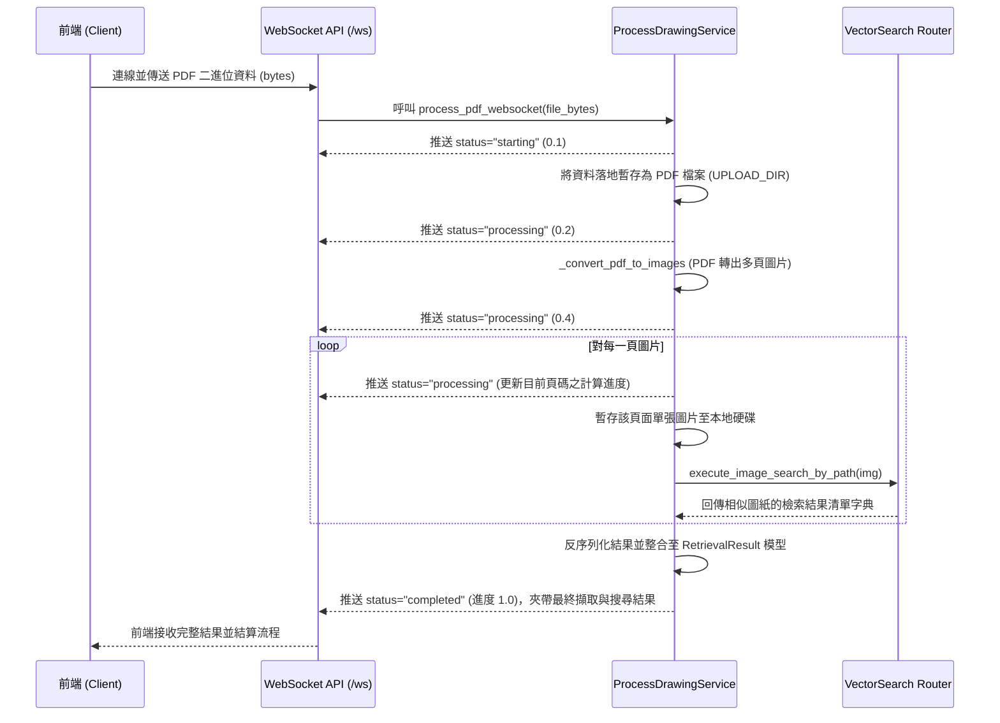

# 01_Business_Logic_Analysis.md

## 1. 核心領域模型 (Domain Models)

本系統的核心業務在於將工程圖 (PDF) 進行拆解、特徵提取，並透過向量搜尋匹配相似的圖紙元件。主要的領域模型包含：

- **Document (工程圖文件)**: 使用者上傳的 PDF 檔案二進位資料。
- **PageImage (圖紙影像)**: 將 PDF 的單一頁面轉換為高解析度 (150 DPI) 的影像，以便進行後續元件萃取與推論。
- **RetrievalResult (檢索結果)**:
  - `parent_pdf_id` (字串, String): 來源工程圖的唯一識別碼。
  - `relevance_score` (浮點數, Float): 分類或相似度的匹配分數。
  - `matched_component_count` (整數, Integer): 匹配到的內部元件數量。
  - `path` (字串/空值, String | None): 原始檔案的路徑。
- **ProcessingStatus (處理狀態)**: 專為 WebSocket 即時回報處理進度而設計的模型。
  - `status` (字串, String): 當前進度狀態（如: `starting`, `processing`, `completed`, `error`）。
  - `message` (字串, String): 狀態詳細說明，供前端顯示文字提示。
  - `progress` (浮點數, Float): 任務的完成比例 (0.0 ~ 1.0)。
  - `result` (列表, List[RetrievalResult] | None): 排程處理完畢後，附帶檢索結果的清單物件。

## 2. 核心業務流程 (Core Workflows)

主要功能由 `ProcessDrawingService` 驅動，採用 WebSocket 形式以非同步流 (stream) 即時回饋進度。

## 3. 邊界條件與例外處理 (Edge Cases)

程式碼中涵蓋了以下幾種邊界條件與例外處理邏輯限制：

1. **PDF 影像轉換失敗 (Conversion Failure)**:
   - 若上傳的檔案因損毀、加密或格式不符，導致 `_convert_pdf_to_images` 發生例外 (Exception) ，系統會在中繼站捕捉，且將回傳空陣列 (`not images`)。此時服務會安全中斷搜尋流程，並推送 `status="error"` 與錯誤訊息 `Failed to convert PDF to images.`，確保前端獲得反應且不陷入無限等待。
2. **WebSocket 斷線處理 (Client Disconnect)**:
   - 架構明確捕捉了 FastAPI 內建的 `WebSocketDisconnect` 例外。若客戶端（如瀏覽器關閉分頁、網路斷線）中途斷開連線時，系統會紀錄日誌 (`Client disconnected`) 並優雅退出，避免因為針對已關閉的 socket 試圖呼叫 `send_text` 而導致伺服器產生崩潰。
3. **全域與預期外故障捕捉 (Global Exception Handling)**:
   - 在主流程任務 (`process_pdf_websocket`) 中，使用泛用型的 `try...except Exception` 包裝。萬一底層模型 (如 `vector_search`) 或記憶體爆炸，會捕捉細節並立刻將 `status="error"` 及錯誤內容轉換為安全格式回傳給前端，最後嘗試確保 WebSocket 即時關閉。
4. **臨時檔案殘留問題 (資源洩漏風險)**:
   - **當前業務限制**：目前的預設流程會將原始上傳的 PDF 與後續轉出的各頁圖片 (`cv2.imwrite`) 皆寫入 `UPLOAD_DIR`。現有邏輯在結束處理與回應後，並沒有自動清理 (Cleanup) 機制，若上線或高頻率呼叫，此邊界死角會導致伺服器硬碟空間很快耗盡 (Disk Exhaustion)。
